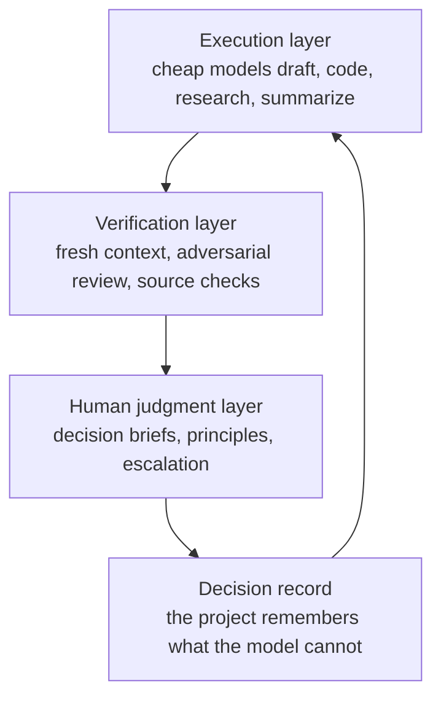

<p align="center">
  
</p>

<h1 align="center">After the Oracle</h1>

<p align="center">
  <strong>A survival skill for AI work when the strongest model is no longer in the room.</strong>
</p>

<p align="center">
  English | <a href="README.ja.md">日本語</a> | <a href="README.zh-CN.md">中文</a>
</p>

<p align="center">
  
  
  
</p>

## When The Oracle Leaves

There is a particular kind of silence that happens after the best model disappears.

The answer used to arrive with weight. You could ask the expensive model, the frontier model, the one that saw the shape of the problem faster than you did. Then the budget runs out, the quota closes, the tool changes, or the model you trusted is no longer there.

What remains is not useless. You still have cheaper models. You still have agents. You still have time, logs, tests, notes, and your own unease when something feels wrong.

But you need a way to turn those pieces into judgment.

**After the Oracle** is that way.

It is a portable Skill for the day you cannot outsource judgment to a stronger mind. It turns weaker models into an execution layer and a verification layer, while keeping the human in the only place that matters: the final judgment layer.

> The oracle may leave.  
> The compass must stay in your hands.

## The Shape Of The System



After the Oracle gives you:

- a canonical Agent Skill at `skills/after-the-oracle/SKILL.md`,
- ready-to-discover copies under `.github/skills/`, `.agents/skills/`, and `.windsurf/skills/`,
- a three-layer operating model for AI-assisted work,
- decision briefs for moments where the agent should stop,
- inspection methods a non-expert can actually use,
- weak-model amplification patterns such as planning passes, adversarial review, role separation, and state externalization,
- adapters for major agent tools: Codex, Claude Code, GitHub Copilot / VS Code, Cursor, Windsurf / Cascade, and Devin.

## Quick Start

Use the canonical Skill:

```text
skills/after-the-oracle/SKILL.md
```

For tools that support Agent Skills, use the copy that matches the tool's discovery path, or copy `skills/after-the-oracle/` into that tool's skills directory.

For tools that rely on persistent instruction files, use the adapters:

| Tool family | File in this repo |
|---|---|
| Codex and AGENTS.md-compatible agents | `AGENTS.md` |
| Claude Code | `skills/after-the-oracle/SKILL.md` and `CLAUDE.md` |
| GitHub Copilot | `.github/copilot-instructions.md` |
| VS Code / Copilot Agent Skills | `.github/skills/after-the-oracle/SKILL.md` |
| VS Code / Copilot path instructions | `.github/instructions/after-the-oracle.instructions.md` |
| Cursor | `.cursor/rules/after-the-oracle.mdc` |
| Cascade / Windsurf skills | `.windsurf/skills/after-the-oracle/SKILL.md` |
| Cross-agent skill discovery | `.agents/skills/after-the-oracle/SKILL.md` |
| Devin CLI rules | `AGENTS.md` |

Read [docs/compatibility.md](docs/compatibility.md) for the current tool mapping and usage notes.

## Use It When

Use it when an AI-assisted task is public, irreversible, expensive to redo, emotionally loaded, strategically important, or long enough that chat memory will start lying to you.

Skip it for tiny reversible tasks. The system is not ceremony. It is a brake for the moments where a wrong direction costs more than a slow start.

## Repository Layout

```text
skills/after-the-oracle/SKILL.md      Canonical source Skill
.github/skills/after-the-oracle/      VS Code / Copilot skill copy
.agents/skills/after-the-oracle/      Cross-agent skill copy
.windsurf/skills/after-the-oracle/    Cascade / Windsurf skill copy
docs/market-research.md              Ecosystem notes and positioning
docs/naming.md                       Naming rationale in English, Japanese, Chinese
docs/compatibility.md                Tool adapters and installation guidance
docs/publishing-checklist.md         GitHub release checklist
templates/PROJECT_DECISION_RECORD.md  Project decision record
assets/                             README visuals
```

## What This Is Not

This is not a prompt pack. It is not a claim that weaker models become wise. It is not another promise that agents can decide everything for you.

The model can draft. The model can verify. The model can argue against itself.

The final judgment remains human.

## License

No final license has been selected yet. Public visibility is not the same thing as a reuse license. See [docs/license-options.md](docs/license-options.md).

