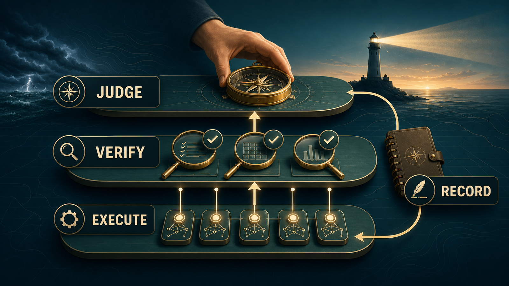

<p align="center">
  
</p>

<h1 align="center">神谕之后的罗盘</h1>

<p align="center">
  <strong>当最强模型不在场时，让人仍然保留判断。</strong>
</p>

<p align="center">
  <a href="README.md">English</a> | <a href="README.ja.md">日本語</a> | 中文
</p>

## 当神谕离开之后

曾经有一段时间，你可以把最难的问题交给最强的模型。

它很贵，但答案有分量。它能更快看见问题的轮廓。它像一个临时的神谕，让人觉得只要问到它，方向就不会错得太远。

可是神谕不会永远在场。

预算会用完，额度会关闭，工具会变化，昨天还能依赖的判断层，今天可能已经不在你手边。

但这不等于你什么都没有了。

你还有便宜的模型，还有代理，还有日志、测试、记录，还有自己心里那一点“哪里不对”的感觉。

你缺的不是另一个神谕。你缺的是把这些东西变成判断的结构。

**神谕之后的罗盘**就是这套结构。

它不假装弱模型已经变强。它把模型放在执行层和验证层，把人放回最终判断层，让有限资源下的 AI 工作仍然有方向、有刹车、有记录。

> 神谕会离开。  
> 罗盘必须留在人手里。

## 先看这一张表

| 当你有这种感觉 | 用神谕之后的罗盘做什么 | 让 AI 产出什么 |
|---|---|---|
| “AI 能帮忙，但不能单独相信它。” | 把执行和验证分开。 | 草稿、独立检查、剩余风险。 |
| “这是公开、昂贵或难以撤回的动作。” | 强制进入人的判断点。 | 包含选项、成本和回退方式的决策简报。 |
| “答案很顺，但哪里不对。” | 运行非专家也能做的检验。 | 发散检查、反转检查、通俗解释。 |
| “项目太长，聊天记忆开始不可靠。” | 把状态外部化。 | 决策记录、假设、下一步行动。 |

## 系统形状

<p align="center">
  
</p>

它包含：

- `skills/after-the-oracle/SKILL.md` 中的标准 Agent Skill
- 放在 `.github/skills/`、`.agents/skills/`、`.windsurf/skills/` 下的可发现副本
- 执行层、验证层、判断层的三层模型
- 让 AI 停下来请求人类判断的决策简报
- 非专家也能使用的 AI 输出检验方法
- 提升低成本模型有效表现的操作技巧
- 面向 Codex、Claude Code、GitHub Copilot / VS Code、Cursor、Windsurf / Cascade、Devin 的适配文件

## 快速开始

核心文件：

```text
skills/after-the-oracle/SKILL.md
```

如果你的工具支持 Agent Skills，请使用对应发现路径里的副本，或把 `skills/after-the-oracle/` 复制到该工具的 skills 目录。

其他工具可以使用本仓库提供的适配文件。

| 工具体系 | 本仓库文件 |
|---|---|
| Codex / AGENTS.md 兼容代理 | `AGENTS.md` |
| Claude Code | `skills/after-the-oracle/SKILL.md` 和 `CLAUDE.md` |
| GitHub Copilot | `.github/copilot-instructions.md` |
| VS Code / Copilot Agent Skills | `.github/skills/after-the-oracle/SKILL.md` |
| VS Code / Copilot path instructions | `.github/instructions/after-the-oracle.instructions.md` |
| Cursor | `.cursor/rules/after-the-oracle.mdc` |
| Cascade / Windsurf skills | `.windsurf/skills/after-the-oracle/SKILL.md` |
| 跨代理 skill 发现 | `.agents/skills/after-the-oracle/SKILL.md` |
| Devin CLI rules | `AGENTS.md` |

更多细节见 [docs/compatibility.md](docs/compatibility.md)。

## 什么时候使用

当任务涉及公开发布、不可逆操作、金钱、认证、安全、长期项目，或者你感觉“方向一旦错了会很贵”时使用它。

小而可逆的任务不需要它。罗盘不是仪式。它的价值在于：该慢的时候慢下来，该验证的时候验证，该由人决定的时候让 AI 停住。

## 它不是什么

它不是提示词合集，不是把弱模型想象成强模型的安慰剂，也不是“AI 可以替你做所有决定”的承诺。

模型可以起草，可以验证，可以反驳自己。

最终判断仍然属于人。

## 可直接复制的示例

| 场景 | 对 AI 这样说 | 好输出应该长什么样 |
|---|---|---|
| 规划发布 | `使用神谕之后的罗盘。先给计划，不要执行。` | 计划、假设、风险、验证路径。 |
| 审查 AI 回答 | `用神谕之后的罗盘对这个回答做对抗验证。` | 可能缺陷、不确定主张、需要检查的点。 |
| 判断是否公开 | `公开前先准备一份决策简报。` | 选项、推荐、可逆性、给人的最终问题。 |
| 继续长期项目 | `更新决策记录，并基于它继续。` | 当前状态、已用决策、下一步行动。 |

## License

目前还没有选择最终许可证。公开可见不等于授予复用权。详情见 [docs/license-options.md](docs/license-options.md)。

